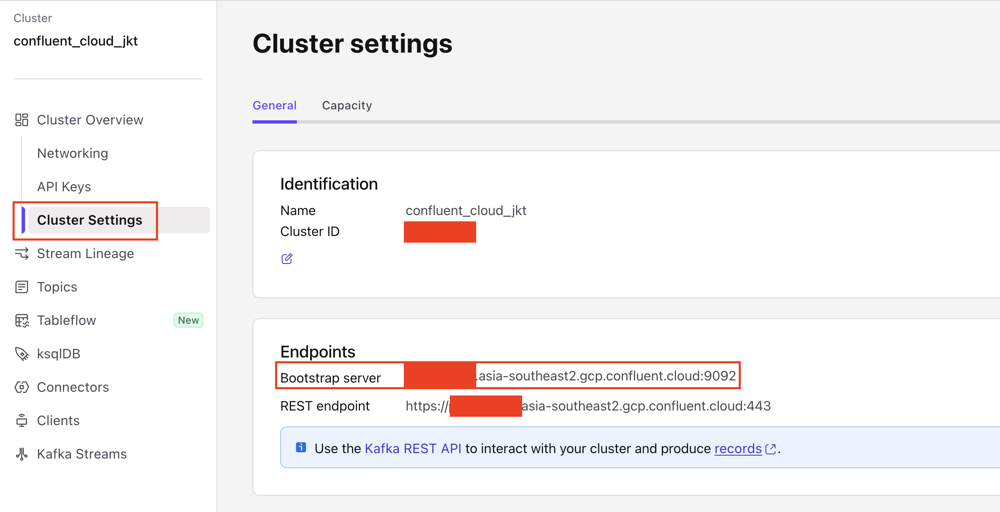
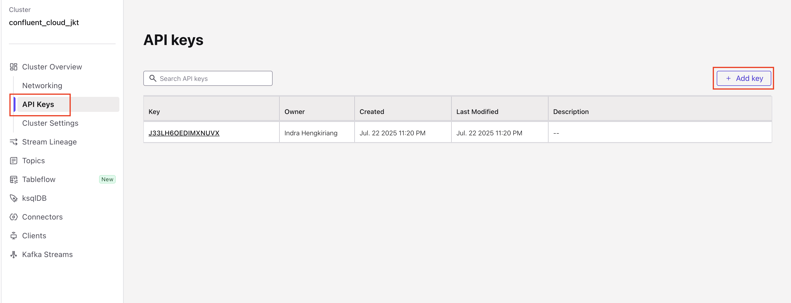
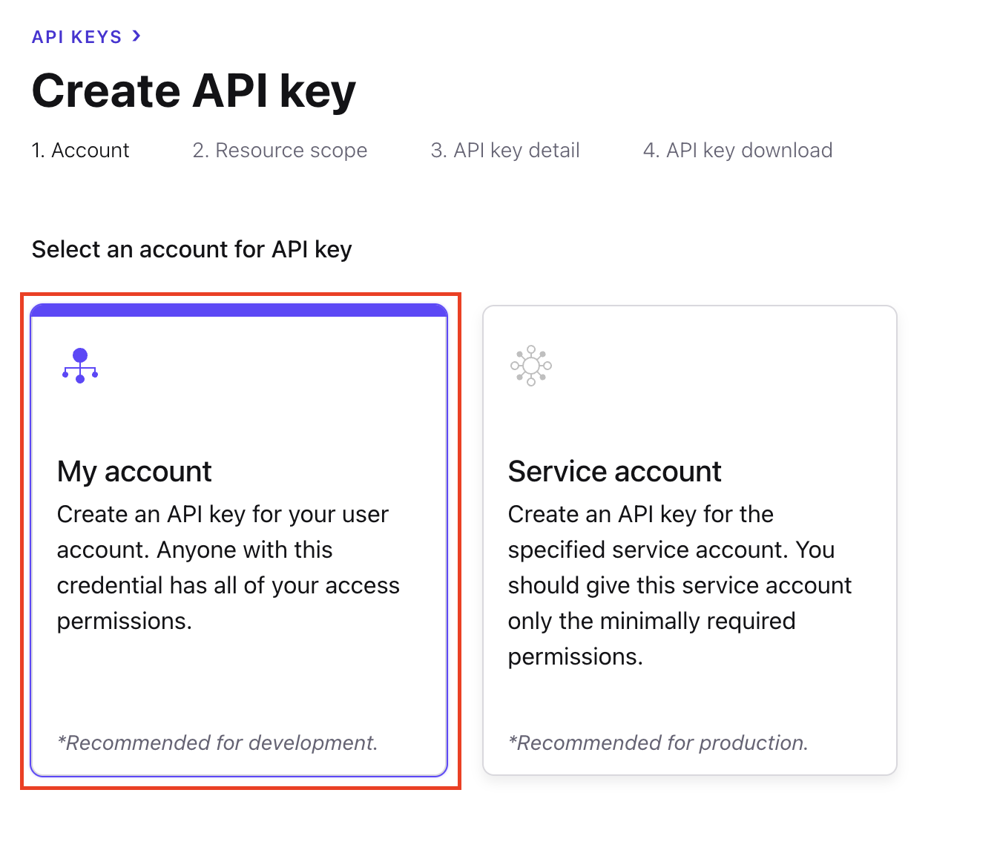
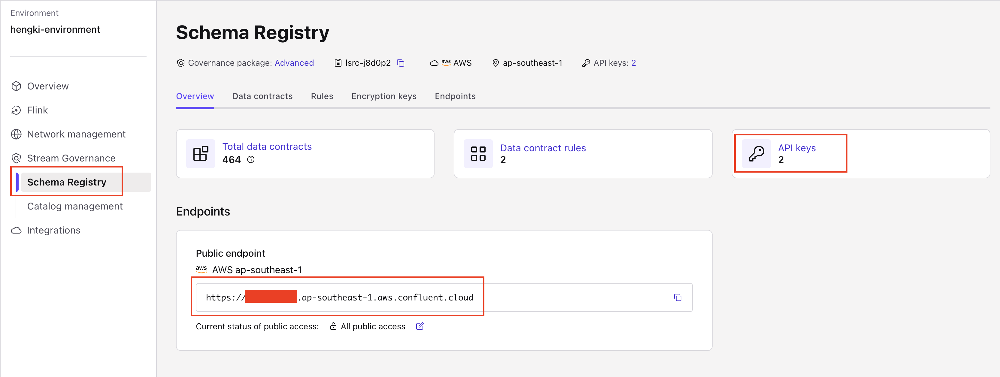
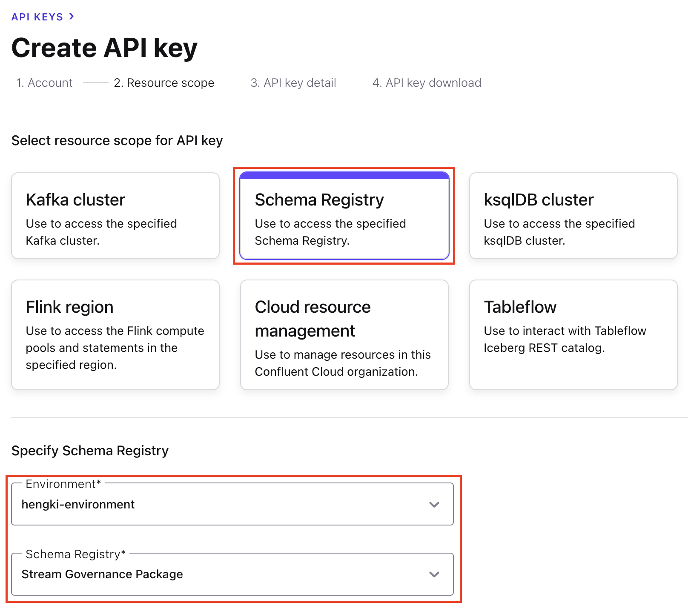
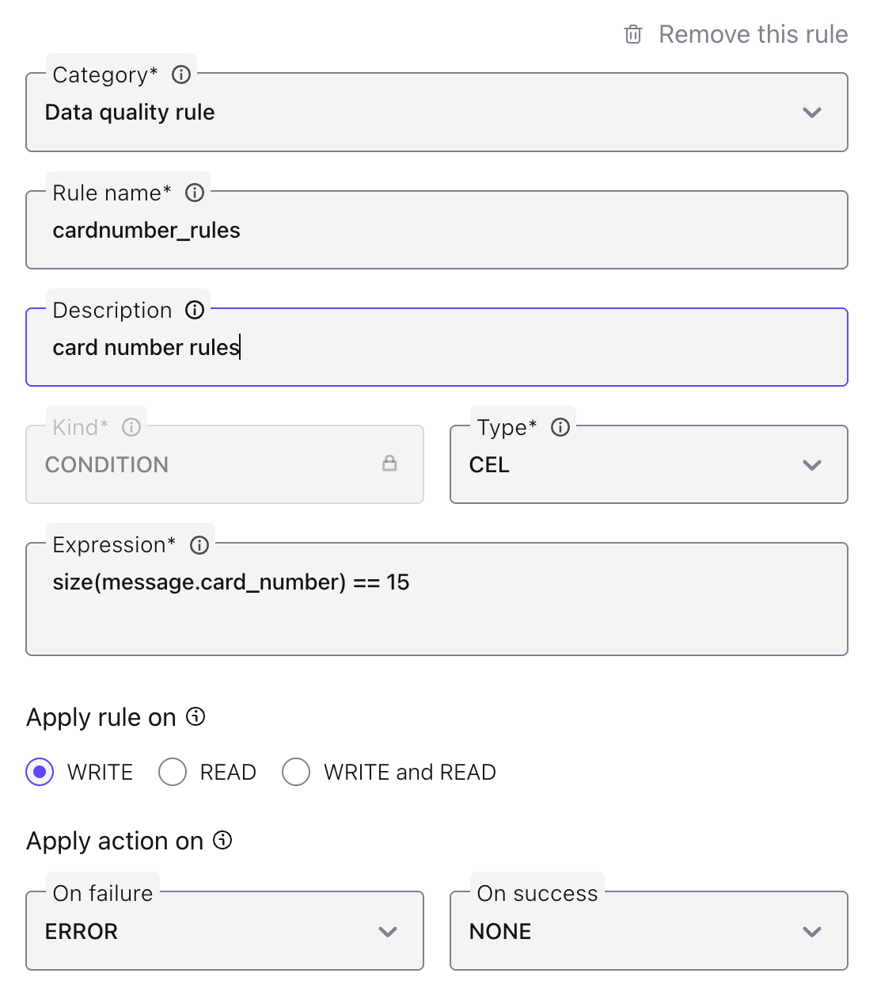
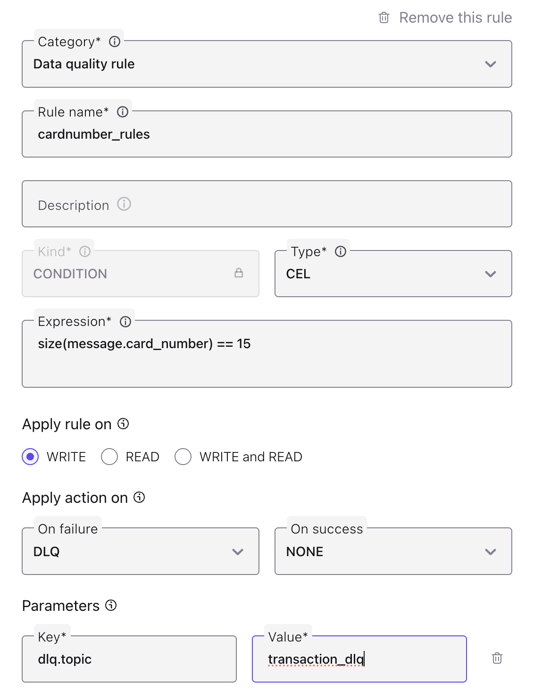

# spring-kafka-200
spring kafka in L200 

Promo Code: **POPTOUT000ZUIK7**

SpringAvroProducerTransaction>SpringAvroConsumerTransaction>SpringAvroProducerUser>SpringAvroConsumerUser

SpringAvroProducerCEL>Create CEL rules 1>SpringAvroProducerCEL>Alter CEL rules 2>SpringAvroProducerCEL

**Get Bootstrap and create Cluster API KEY on the cluster page**

    

    

    

**get the SR URL and create SR API KEY on the environment page**

    

    

    

**CEL Rules 1**

    

**CEL Rules 2**

    

